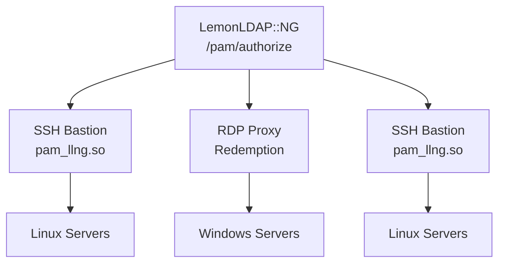

# Competitors and Alternatives

This document compares LLNG-PAM-MODULE with alternative solutions for
SSH authentication, authorization, and session management.

## Solution Categories

There are two distinct meanings of "PAM" in the security industry:

- **PAM (Pluggable Authentication Modules)**: Linux authentication framework
- **PAM (Privileged Access Management)**: Enterprise security product category

LLNG-PAM-MODULE addresses both: it's a Linux PAM module that, combined with
LemonLDAP::NG's bastion feature, provides Privileged Access Management capabilities.

---

## Direct Competitors: PAM Modules for SSO

These are alternative PAM modules for centralizing SSH authentication:

| Solution | Protocol | Features | Limitations |
|----------|----------|----------|-------------|
| **pam_sss (SSSD)** | LDAP, Kerberos | Widely deployed, FreeIPA integration | No web SSO, complex setup |
| **pam_krb5** | Kerberos | Strong enterprise auth | Requires Kerberos infrastructure |
| **pam_ldap** | LDAP | Simple, direct LDAP auth | No SSO, no MFA integration |
| **pam_cas** | CAS | Apereo CAS integration | Limited to CAS protocol |
| **pam_oauth2** | OAuth2 | Modern protocol | Community-maintained, limited features |

### LLNG-PAM-MODULE Advantages

- Unified web SSO and system authentication
- Built-in MFA support via LemonLDAP::NG
- Server groups for granular access control
- Token-based authentication (no password exposure)
- Session recording via bastion mode

---

## IAM/SSO Solutions Comparison

Complete Identity and Access Management solutions with system integration:

| Solution | Type | PAM Integration | Web SSO | Session Recording |
|----------|------|-----------------|---------|-------------------|
| **LemonLDAP::NG + PAM Module** | Open source | Native | ✅ | ✅ (bastion) |
| **FreeIPA** | Open source | Via SSSD | Limited | ❌ |
| **Keycloak** | Open source | Third-party | ✅ | ❌ |
| **Authentik** | Open source | Limited | ✅ | ❌ |
| **Apereo CAS** | Open source | pam_cas | ✅ | ❌ |

### Key Differentiators

LemonLDAP::NG with LLNG-PAM-MODULE is unique in providing:

1. **Single solution** for web SSO AND system access
2. **Native PAM module** designed specifically for the SSO
3. **Bastion with session recording** for audit compliance
4. **Centralized policy management** for both web and SSH access

---

## Privileged Access Management (PAM) Solutions

Enterprise solutions focused on privileged access control and session recording:

| Solution | License | Cost | Web SSO | Session Recording | SSH Auth |
|----------|---------|------|---------|-------------------|----------|
| **LLNG + Bastion** | AGPL | Free | ✅ | ✅ | ✅ |
| **Wallix Bastion** | Proprietary | €€€ | ❌ | ✅ | ✅ |
| **CyberArk** | Proprietary | €€€€ | ❌ | ✅ | ✅ |
| **BeyondTrust** | Proprietary | €€€€ | ❌ | ✅ | ✅ |
| **Delinea (Thycotic)** | Proprietary | €€€ | ❌ | ✅ | ✅ |

### Feature Comparison with Wallix

Wallix is a French company whose Wallix Bastion product is often considered in the same market.
Here's a detailed comparison:

| Feature | LLNG + Bastion | Wallix Bastion |
|---------|----------------|----------------|
| **SSH Session Recording** | ✅ | ✅ |
| **Session Playback** | ✅ | ✅ |
| **Multi-Factor Authentication** | ✅ (built-in) | ✅ (add-on) |
| **Web Single Sign-On** | ✅ | ❌ |
| **SAML/OIDC Provider** | ✅ | Limited |
| **Centralized Access Policies** | ✅ | ✅ |
| **Password Vault** | Unneeded (SSH CA) | ✅ |
| **RDP Recording** | ✅ (via Redemption) | ✅ |
| **License** | AGPL (Free) | Proprietary |
| **Typical Cost** | Free | 50-100€/user/year |

### When to Choose LLNG

Choose LemonLDAP::NG + PAM Module when you need:

- **Web SSO + System Access** in a unified solution
- **Open source** with no licensing costs
- **French sovereignty** with open source flexibility
- **SSH-focused** privileged access management
- **Custom integration** capabilities

### When to Consider Wallix/CyberArk

Consider commercial PAM solutions when you need:

- **Built-in password vault** with automatic rotation
- **Vendor support contracts** required by policy
- **Pre-certified compliance** (some regulations accept specific vendors)
- **Turnkey solution** without custom integration

---

## RDP Support via WALLIX Redemption

LemonLDAP::NG now supports RDP session recording through integration with
[WALLIX Redemption](https://github.com/wallix/redemption), an open-source
RDP proxy from the French company Wallix.

### Architecture

### Key Features

| Feature | Details |
|---------|---------|
| **Native RDP client** | Works with mstsc.exe and other RDP clients |
| **Session recording** | `.wrm` format, convertible to MP4 |
| **Unified authorization** | Same `pamAccessServerGroups` as SSH |
| **Authentication hook** | Python-based integration with LLNG API |

### Comparison with Commercial Solutions

| Feature | LLNG + Redemption | Wallix Bastion | CyberArk |
|---------|-------------------|----------------|----------|
| RDP proxy | ✅ | ✅ | ✅ |
| Session recording | ✅ | ✅ | ✅ |
| Web SSO integration | ✅ | ❌ | ❌ |
| Open source | ✅ (GPL-2.0) | ❌ | ❌ |
| Cost | Free | €€€ | €€€€ |

### Limitations

- **License**: Redemption is GPL-2.0 (modifications must be published)
- **Password vault**: Not included (pass-through mode for credentials)
- **NLA support**: Works but requires careful configuration

See [rdp-feasibility.md](rdp-feasibility.md) for detailed technical analysis.

---

## Migration Paths

### From pam_ldap or pam_krb5

1. Deploy LemonLDAP::NG with your existing LDAP/AD backend
2. Install LLNG-PAM-MODULE alongside existing PAM config
3. Test with a pilot group using LLNG tokens
4. Gradually migrate users to LLNG authentication
5. Remove legacy PAM modules

### From Commercial PAM Solutions

1. Assess current session recording requirements
2. Deploy LLNG bastion for SSH access
3. Migrate SSH servers first (LLNG strength)
4. Keep commercial solution for RDP if needed
5. Evaluate cost savings after migration

---

## Summary

LLNG-PAM-MODULE with LemonLDAP::NG provides a unique combination:

- **Cost**: Free and open source vs €50-100/user/year for commercial PAM
- **Scope**: Web SSO + SSH + bastion in one solution
- **Flexibility**: Fully customizable policies and integrations
- **Compliance**: Session recording for audit requirements

For organizations primarily using Linux/SSH infrastructure and needing web SSO,
LemonLDAP::NG offers the most comprehensive and cost-effective solution.
