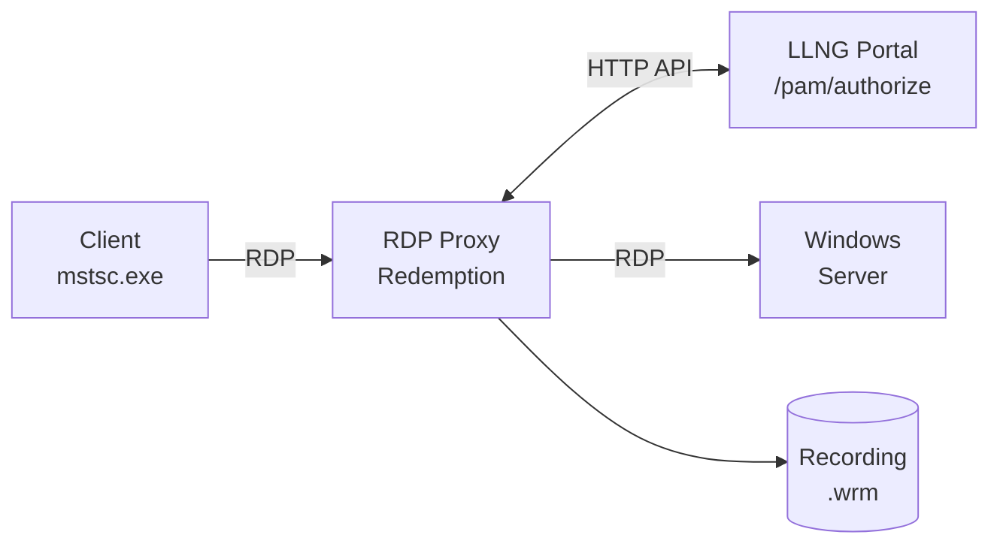

# RDP Proxy PoC with LemonLDAP::NG

This Proof of Concept demonstrates RDP session recording and authorization
using WALLIX Redemption integrated with LemonLDAP::NG.

## Overview



## Prerequisites

- Docker and Docker Compose
- Windows Server with RDP enabled (target machine)
- Network connectivity from Docker to Windows Server

## Quick Start

### 1. Configure Windows Target

Set the IP address of your Windows Server:

```bash
export WINDOWS_TARGET_HOST=192.168.1.100
```

### 2. Start the Services

```bash
cd docker-rdp-poc
docker compose up -d
```

This will:
- Build the LemonLDAP::NG SSO container
- Build the Redemption RDP proxy container
- Start both services

### 3. Enroll the RDP Proxy

The RDP proxy needs to be enrolled with LLNG (one-time setup):

```bash
# Get enrollment token from LLNG
docker exec -it llng-rdp-proxy llng-pam-enroll \
    --portal http://sso:8080 \
    --server-group rdp-proxy
```

### 4. Connect with RDP Client

Use your RDP client (mstsc.exe, Remmina, etc.) to connect:

- **Host**: `localhost:3389`
- **Username**: Your LLNG username (e.g., `dwho`)
- **Password**: Your LLNG password

The proxy will:
1. Authenticate you via LLNG
2. Check authorization (same `pamAccessServerGroups` as SSH)
3. Connect to the Windows target
4. Record the session

## Architecture

### Components

| Component | Port | Description |
|-----------|------|-------------|
| `sso` | 80 | LemonLDAP::NG Portal |
| `rdp-proxy` | 3389 | WALLIX Redemption RDP Proxy |

### Authorization Flow

1. User connects to `rdp-proxy:3389` with mstsc.exe
2. Redemption calls `passthrough.py` with user credentials
3. `passthrough.py` calls LLNG `/pam/authorize` API
4. LLNG checks `pamAccessServerGroups` (same rules as SSH)
5. If authorized, Redemption connects to Windows target
6. Session is recorded to `/var/lib/llng-sessions/rdp/`

### Configuration Files

| File | Description |
|------|-------------|
| `redemption/config/rdpproxy.ini` | Redemption configuration |
| `redemption/config/passthrough.py` | LLNG authentication hook |
| `lmConf-1.json` | LLNG portal configuration |

## Session Recording

### Recording Location

Recordings are stored in `/var/lib/llng-sessions/rdp/`:

```
/var/lib/llng-sessions/rdp/
├── dwho/
│   ├── 20251216-103000_<uuid>.wrm       # Recording
│   └── 20251216-103000_<uuid>.json      # Metadata
└── rtyler/
    └── ...
```

### View Recordings

```bash
# List recordings
docker exec -it llng-rdp-proxy ls -la /var/lib/llng-sessions/rdp/

# Convert to MP4 for viewing
docker exec -it llng-rdp-proxy redrec --to-mp4 \
    /var/lib/llng-sessions/rdp/dwho/recording.wrm

# Play recording directly (requires X11 forwarding)
docker exec -it llng-rdp-proxy redrec --play \
    /var/lib/llng-sessions/rdp/dwho/recording.wrm
```

### Metadata Format

Each recording has a JSON metadata file:

```json
{
    "session_id": "550e8400-e29b-41d4-a716-446655440000",
    "user": "dwho",
    "client_ip": "192.168.1.50",
    "target_host": "windows-server.example.com",
    "start_time": "2025-12-16T10:30:00Z",
    "end_time": "2025-12-16T11:45:23Z",
    "protocol": "rdp"
}
```

## Server Groups Configuration

The RDP proxy uses the same `pamAccessServerGroups` as SSH.
Configure in LLNG Manager:

```perl
# Example: Allow SRE team to access Windows production servers
$hGroups->{sre} or $hGroups->{admins}
```

Users authorized for a server group via SSH are automatically
authorized for RDP to the same servers.

## Troubleshooting

### Check Proxy Logs

```bash
docker logs llng-rdp-proxy
docker exec -it llng-rdp-proxy cat /var/log/rdpproxy/rdpproxy.log
docker exec -it llng-rdp-proxy cat /var/log/rdpproxy/passthrough.log
```

### Check LLNG Logs

```bash
docker logs llng-rdp-sso
```

### Test Authorization Manually

```bash
# Test LLNG authorization API
curl -X POST http://localhost/pam/authorize \
    -H "Authorization: Bearer <server_token>" \
    -H "Content-Type: application/json" \
    -d '{"user": "dwho", "host": "windows-server", "service": "rdp"}'
```

### Common Issues

| Issue | Solution |
|-------|----------|
| Connection refused | Check Windows firewall allows RDP (3389) |
| Authorization failed | Verify user is in correct server group |
| Recording not created | Check `/var/lib/llng-sessions/rdp/` permissions |
| NLA error | Disable NLA on Windows target for PoC |

## Security Considerations

### PoC Limitations

This PoC is **not production-ready**:

- [ ] Self-signed certificates (use proper PKI in production)
- [ ] Pass-through credentials (consider vault integration)
- [ ] NLA disabled (enable for production)
- [ ] No high availability

### Production Recommendations

1. **TLS Certificates**: Use proper CA-signed certificates
2. **Credential Vault**: Integrate with HashiCorp Vault or similar
3. **NLA**: Enable Network Level Authentication
4. **Monitoring**: Add Prometheus metrics and alerting
5. **Backup**: Implement recording backup and retention policy

## License

WALLIX Redemption is licensed under **GPL-2.0**.
Modifications must be published under the same license.

## References

- [WALLIX Redemption](https://github.com/wallix/redemption)
- [LemonLDAP::NG](https://lemonldap-ng.org/)
- [RDP Feasibility Study](../doc/rdp-feasibility.md)
- [Bastion Architecture](../doc/bastion-architecture.md)
